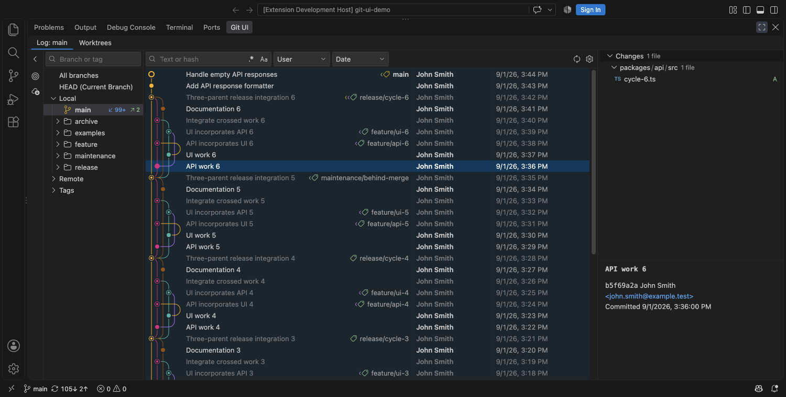
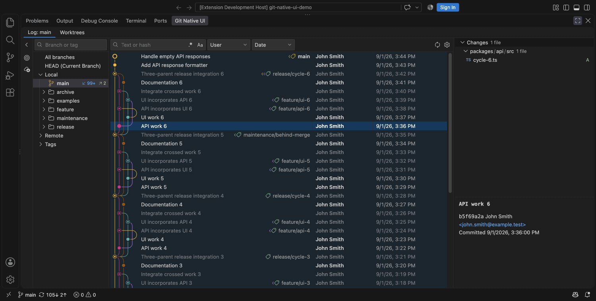
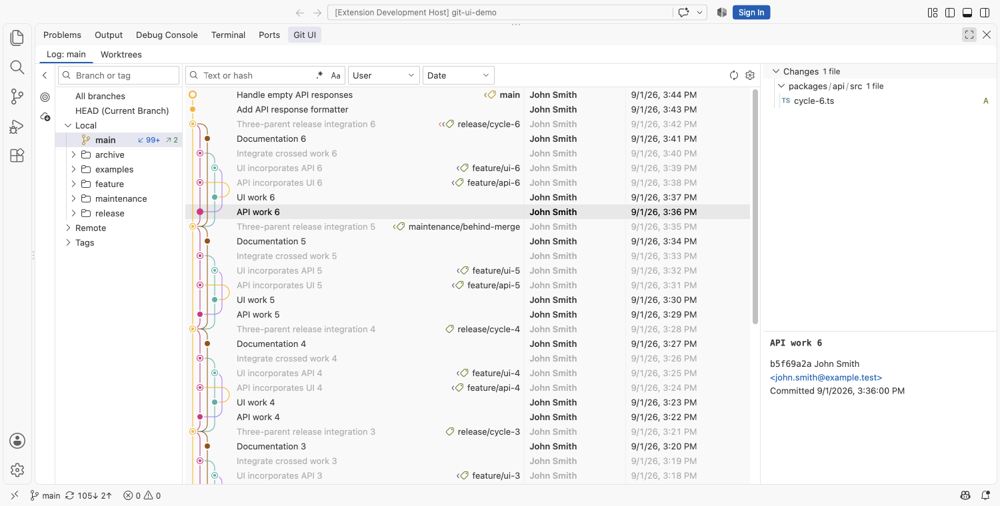

# Git Native UI

**Finally, a proper Git UI for VS Code.**

Git Native UI is a free, focused alternative to [GitLens](https://github.com/gitkraken/vscode-gitlens) for browsing history, managing branches and worktrees, and inspecting changes. It uses familiar VS Code styling, follows your chosen theme, and opens file comparisons in VS Code's native diff editor.

Inspired by the Git tool window in JetBrains' [IntelliJ IDEA Community Edition](https://github.com/JetBrains/intellij-community).

**Completely free and open source. No subscriptions or paid tiers.**

## What you can do

- **Explore history.** Browse local branches, remote branches, and tags. Filter commits by text, revision, author, or date.
- **Inspect changes.** Select a commit to see its message and files. Compare merge commits with each parent and open file diffs in the editor.
- **Manage branches.** Check out, create, rename, delete, update, merge, or rebase. Restore an accidentally deleted branch from its notification.
- **Work with commits.** Cherry-pick, edit messages, squash, or drop eligible commits. Create a branch or tag from a commit.
- **Use worktrees.** Create a working folder for a branch, open it in this window or a new one, and remove it when finished.

Branch, commit, and worktree lists support multiple selection. Use VS Code's Source Control and editors to resolve conflicts.

## See it in action

Select commits, inspect merge parents, open changed files in the diff editor, filter history, and switch to worktrees:

The panel follows your VS Code theme. Here it is in Light Modern:

## Get started

1. Open a local Git repository in VS Code.
2. Run **View: Open View...** from the Command Palette and choose **Git Native UI**.
3. Select a commit, or double-click a branch to browse its history. Browsing a branch keeps your checkout unchanged.

## Your repositories stay yours

Git Native UI has no account, cloud backend, or analytics service. Fetch connects to your configured Git remotes using VS Code's Git authentication.

## Feedback and contributions

[Report a bug or suggest a feature](https://github.com/andreymyssak/vscode-git-native-ui/issues). To contribute, see [CONTRIBUTING.md](CONTRIBUTING.md).

For security vulnerabilities, follow the private reporting instructions in [SECURITY.md](SECURITY.md).

## License

Authored code is [MIT licensed](LICENSE.txt). Bundled Microsoft code and libraries retain their licenses in [THIRD_PARTY_NOTICES.md](THIRD_PARTY_NOTICES.md).
